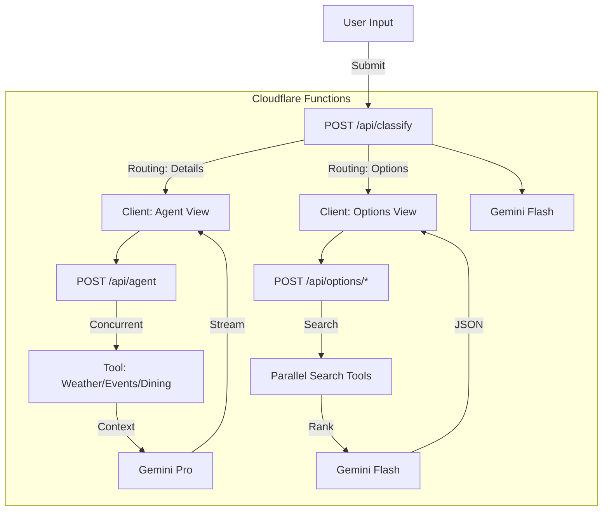

# 02_Architecture.md

## Overview
This document maps the original n8n workflow logic to the Cloudflare Pages + Functions architecture. The goal is to replicate the "Ralph Wiggum" agentic behavior (Simple, Secure, Fast) using serverless functions and client-side logic.

## Application Flow

### 1. User Input (Client)
*   **Component**: `FormFlow.tsx`
*   **Action**: Collects `Destination`, `When`, `Activities`, `Dealmaker`.
*   **State**: React State (Zustand or Context).

### 2. Classification (Backend)
*   **Endpoint**: `POST /api/classify`
*   **Logic**: Replaces the n8n "Gemini Router" node.
*   **Input**: User Query JSON.
*   **Output**:
    ```json
    {
      "routing": "Details" | "Options_Destinations" | "Options_Activities" | "Options_Both",
      "extracted": { ... }
    }
    ```
*   **Model**: Google Gemini Flash 2.0 (Fast, Cheap).

### 3. Routing Logic (Client)
*   The Client receives the `routing` decision and decides which "Screen" to show next:
    *   `Details` -> Show "Generating Experience..." (Streams `POST /api/agent`)
    *   `Options_*` -> Show "Options Feed" (Calls `POST /api/options/*`)

### 4. Core Agent (Backend)
*   **Endpoint**: `POST /api/agent` (Streaming)
*   **Logic**: Replaces "Wondura Agent v3" node.
*   **Steps**:
    1.  **Parallel Search**: Execute `Weather`, `Events`, `Dining`, `Activities` tools concurrently (`Promise.all`).
    2.  **Context Assembly**: Combine Tool Outputs + User Context.
    3.  **Generation**: Stream Gemini response to Client.
    4.  **Format**: Returns Markdown/JSON chunks.

### 5. Options Generation (Backend)
*   **Endpoints**:
    *   `POST /api/options/destinations`
    *   `POST /api/options/activities`
    *   `POST /api/options/both` (Combined: Returns Destinations with 2 Activities each)
*   **Logic**: Replaces "Destination Options", "Activity Options", "Both Options" parallel nodes.
*   **Behavior**:
    *   Strict Geo-Fencing (e.g., "South Island" only).
    *   Ranking Logic (0-5 stars).
    *   Image Search (placeholder `image_query` field for frontend to resolve).

### 6. Verification Tools (Backend - Internal)
*   **Price Verification** (`tools/price.ts`): Validates pricing against live web data.
*   **Venue Verification** (`tools/venue.ts`): Confirms venue is open/operational for dates.

## Data Flow Diagram



## State Management
*   **URL State**: Deep linking supported via Query Params (e.g., `?q=Queenstown&date=Oct`).
*   **Session State**: `useWondura` hook manages the current "Chat" history and "Options" selection.

## Error Handling
*   **n8n Retries** -> Cloudflare `retry()` middleware.
*   **Validation** -> Zod Schema validation on all API inputs.
*   **Fallbacks** -> If Tools fail, Agent proceeds with "General Knowledge" but flags it.
